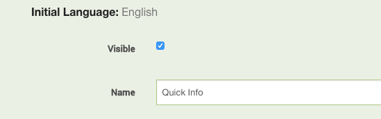
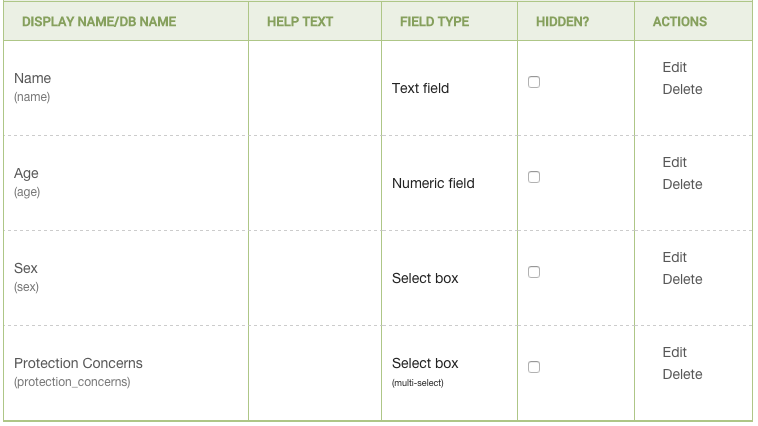
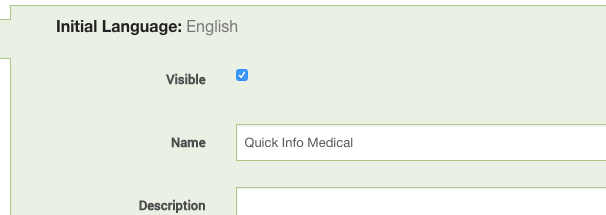
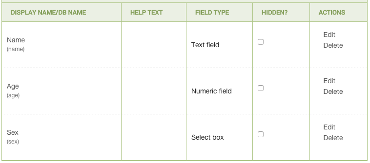
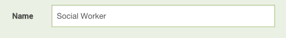
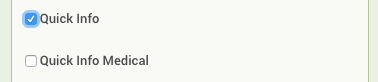
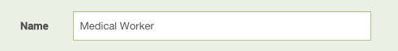

Referrals and Transfers
-----------------------

### When a user performs an external referral, is the user they referred to required to follow up on the referral?

Currently, requiring referees to follow up on the referrals they are
sent is a human process; not one mandated by the Primero platform. Such
a feature may be considered as development on Primero continues.

### When I perform an external referral to someone on a different Primero system, how do I send them the referral file and the password to access it?

This will depend on the information sharing protocol (ISP) agreed upon
by the appropriate country steering committee. If you do not have access
to an ISP, please consult with your local steering committee.

### Is owner just the person who registers the case, or can the owner be changed?

An owner can be changed through a *transfer*. Only certain users with
the proper permissions can perform a transfer--usually managers and
administrators. When a transfer occurs--say from User One to User
Two--User One will no longer have access to the selected file, even if
she was the user to originally register the case. User Two will be the
new case owner and will have full access to its information.

### On the Record Owner form, I see a field labelled, “Other assigned users.” What does this mean?

When you refer a case to another user, they need to have access to your
case’s information, but you do not want to make them a record owner.
Therefore, both you and the referee are considered “assigned users,”
meaning that both of you have some access to the case.

Forms
-----

### How can I have the same piece of information display on different forms?

Any fields using the same DB name will display the same information. For
instance, if you have two different form sections, “Basic Information”
and “Follow Up Information,” and each contains a field with the DB name
“age,” then when enter and save age on the “Basic Information” form, the
same value will then also display on the “Follow Up Information” form.

### How can I make it so that a user only sees certain fields on a form?

The way Primero does this is by limiting access to particular form
sections. Say you have two users, one who has the “Social Worker” role,
and another who has the “Medical Worker” role, and both of whom need to
have access to the “Quick Info” form. The standard basic identity form
contains the fields “Name,” “Age,” “Sex,” and “Protection Concerns,” but
you only want the medical worker to have access to “Name,” “Age,” and
“Sex.” The best way to do this would be to create a special form for the
medical worker that only contains those three fields.

*Form for Social Worker:*

*Form for Medical Worker:*

*Social Worker Role:*

*Medical Worker Role:*

Because both forms contain three of the same fields with the same DB
names, they will display the same data. In the image above, for the
“Quick Info Medical” form, the DB names are the words in parentheses
below the display names. So, for the “Name” field, you should see “name”
below it in parentheses. The same is visible on the “Quick Info” form.
This means that if the social worker records the name on their form, the
medical would be able to see the same name on their own form later.

### Why is there a “Full Name” field if there are also “First Name,” “Middle Name,” and “Surname” fields?

Having a “Full Name” allows quick data entry during scenarios requiring
rapid registration, while the “First Name,” “Middle Name,” and “Last
Name” fields allow users to more precisely record their case’s name.
Only the “Full Name” field is searchable in the case list view. For this
reason, it is preferable to record the subject’s name in this field.

### How can a user create and/or review a case plan?

A fully-functioning case plan form, along with the ability to approve a
case plan, is currently in the development roadmap.

Records
-------

### What are these different types of ID I see? (Long ID, Short ID, Case ID)

The Long ID is a long series of characters generated by an algorithm and
virtually guaranteed to be unique. This makes for a convenient means of
finding a very specific record. Since this series of characters is so
long and hard to remember, though, there is also a Short ID, which is
simply the last seven characters of the Long ID. Both Long ID and Short
ID are automatically included in all exports as a means of
distinguishing between records. Lastly, the Case ID is a series of
characters determined by a pre-set formula which, while still keeping
the individual behind the case anonymous, should be more recognizable to
a worker. For instance, the Case ID could be the abbreviation for the
district where the record was registered plus a dash, the last letter of
the child’s first name, the day of the month when the child was born,
and the Short ID. Such a pattern gives no vital information about the
individual, but allows the case worker to distinguish easily between
records.

### Can I clone a record?

This is not currently part of Primero’s functionality, but may be taken
into consideration as development continues.

### Can cases and incidents be linked?

No. While an incident can be created from a case, cases cannot be
created from incidents, and no data linkage currently exists between
cases and incidents. If this change were ever to be made, intense
discussions of security would need to occur, and an extensive agreement
would need to be reached over how data is shared between the MRM, CP,
and GBV modules.

### What does “duplicate” mean as a case status?

“Duplicate” is a case status reserved for those cases which are found to
be duplicates of other cases--as in the case of a single child moving
from camp to camp, giving slightly altered names to different workers.
Having a separate status for this state allows users to leave these
cases out of reports without deactivating them entirely.

Exports
-------

### When I export information, what fields can I put in my export?

A user can export whichever fields are on their permitted forms. So, for
instance, if you have permission to view the “Basic Identity” form,
which has the “date\_of\_birth” field, you would be able to export
“date\_of\_birth.” However, if you wanted to export the
“protection\_concerns” field but do not have access to the “Protection
Concerns” form that holds the field, you would not be able to export
“protection\_concerns.” One important exception to this rule is the
“name” field, which cannot be exported for security reasons.

### What is a JSON export, and what kind of data can it hold?

JSON is the most human-readable--and therefore the preferred--format for
carrying the data that Primero uses. It can be used for exporting and
importing case and incident data, as well as configuration bundles.
These export and import actions, however, are only available to those
users whose roles have been given access to them. For instance, an
administrator may be the only role able to import and export
configuration bundles, while most users will have roles which are
permitted to import and export case or incident data. Please note that,
while JSON files are relatively easy to read, they may also be enormous,
and so may take up a lot of space or just be difficult to search
through.

### How can I perform a quick backup of my data?

If you ever encounter a situation in which you need to quickly backup
all of your case, tracing request, or incident data, exporting is always
a potential solution. All export options will allow you to have a copy
of your data, but some will be easier to import back into a Primero
instance than others. In particular, JSON, CSV, Excel, and Custom
exports will export in a format which can be directly imported back into
Primero without the need to manipulate headers, making them convenient
options for data backups. Other options such as the List View and PDF
exports do not afford this convenience.

An additional advantage to using a custom export is that it allows you
to specify which fields you would like to have included in the exported
document--a useful feature in case you are particularly worried about
the security of your data backup. Limiting the number of included fields
may be limiting in the amount of data you can recover in the case of
some catastrophic event, but can also prevent the wrong information
falling into the wrong hands. Other types of exports prevent you from
exporting any fields to which your role does not have access but do not
allow you to specifically include or exclude fields from an export. All
exports, however, are automatically encrypted with a password of your
choice, which generally prevents them from being opened by unwanted
viewers.

Security
--------

### Can you delete the database remotely in case of emergency?

This is not currently part of Primero’s functionality, but may be taken
into consideration as development continues.

### Who owns the data?

This depends on any specific agreements reached with the host country’s
government or between the organizations involved in the implementation, though the baseline scenario is that data subjects own their data.
Once again, this will vary with each implementation.

Support
-------

### How are Level 3 support changes and code updates distributed to all instances of Primero in a deployment?

Level 3 support changes and code updates are treated as tantamount to a
system upgrade. These will need to be carefully scheduled and
coordinated between all stakeholders. While deploying the fix to the
centrally-hosted instance is a relatively simple, one-time action,
deploying to local and roving instances requires coordination on the
part of the individuals responsible for the maintenance of the local or
roving instance in question. This process can be complicated by low
bandwidth as the application file is 1.5 GB in size and takes a good
amount of time to download.

Flagging
--------

### What is a flag?

A flag can be thought of as a reminder placed on a case to be read by
the owner of that case. Only some users have permission to place flags.

### What is a scheduled activity?

A scheduled activity is simply a flag that is pre-set to appear on a
certain date. So, for instance, if you are a manager and want to remind
one of your social workers to follow up on their case a week from now,
you could set a flag to appear next Wednesday, which would then remind
the worker that they have a follow up to perform. This flag with a
scheduled date to appear is a scheduled activity.

### Can I flag a case to anyone?

A flag only ever appears for the user who owns the case that has been
flagged. When you log in, your dashboard should show flags that have
placed on your cases and no one else’s.

Installation
------------

### When I try to install, my computer tells me that I need to enable virtualization. What does that mean, and how do I fix it?

Virtualization is what allows Primero to run a server inside your
computer and thus make Primero available via the web browser. For
instructions on how to enable virtualization, please consult the Primero
Windows Installer - Administration and Installation Guide.

Mobile
------

### Can I only sync with a central instance on mobile?

The mobile client allows users to sync with either a central instance
with an internet-accessible URL or with a local library instance,
accessible over a private network via a locally-registered URL. The user
chooses the URL which they want to use for syncing when logging in.

Migration
---------

### How do I migrate Child Protection data from CPIMS?

First, export the data you wish to migrate from CPIMS into a CSV file.
The headers in this file will represent data fields that may or may not
also be present in Primero. Make a mapping of the headers in the file to
their corresponding field names in Primero, then replace the old headers
with the new Primero ones. At this point, you will import the edited CSV
file into Primero to complete the migration process.

### How do I migrate incident data from the GBV Incident Recorder?

Currently, the Incident Recorder exports to a CSV format with headers
that are very similar to those of Primero. As with Child Protection
data, you must make a mapping of the Incident Recorder file headers with
their corresponding field names in Primero, and then replace the old
headers with the new ones. Once this is done, you may import the edited
CSV file into Primero.

### How do I migrate MRM data into Primero?

The process for migrating data from MRMIMS is not well defined at this
time but will follow similar principles to those governing the CP and
GBV migration processes.

General
-------

### How do I get a deployment of Primero for my country?

To request a deployment of Primero in your country, please contact the
appropriate steering committee for the module you would like to deploy
(Child Protection, Gender-Based Violence, or Monitoring and Reporting
Mechanism).

### Which hosting options are right for my situation?

Generally, a choice between the various hosting options depends on the
availability of on-the-ground infrastructure and expertise, as well as
the legal and security issues surrounding the physical location of
data’s storage. Third-party cloud hosting options are preferable in
situations where there is little on-the-ground infrastructure or
expertise, and where involved parties are not too squeamish about data
being stored outside the country. Unless the local government or another
participating entity has the proper facilities and a fully-staffed
technical team to maintain servers, third-party cloud hosting offers a
cost-effective and realistic way of hosting a secure, well-performing
application. Given the fact that attacks on web applications are
absolutely imminent, regardless of their data’s importance, it generally
makes sense to opt for a third party operation which has entire teams
dedicated to designing and implementing security measures. This option
also may be advantageous in situations where there is a fear of local
servers falling into the hands of threatening militant groups.
Locally-hosted options, meanwhile, are advantageous in situations where,
as mentioned before, there is proper capacity to maintain the necessary
software and hardware, and where there are security or legal
considerations, which dictate that data be physically stored within a
country’s borders.

